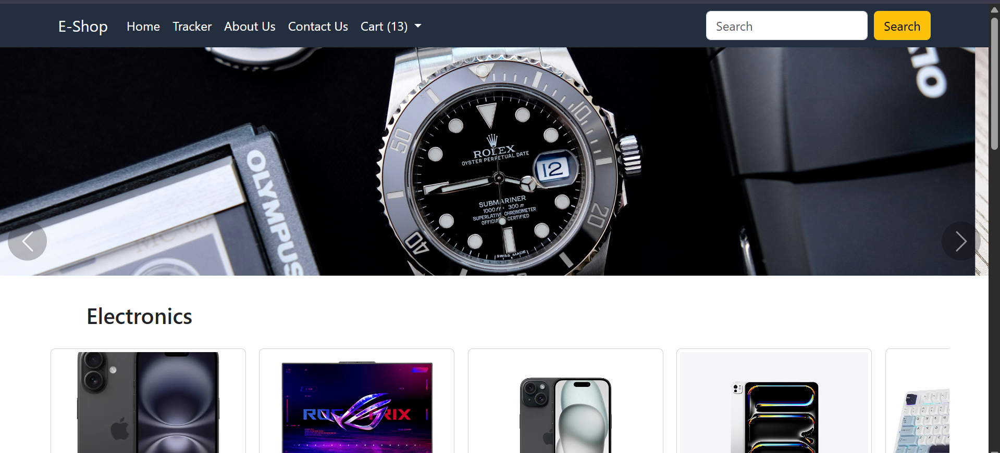
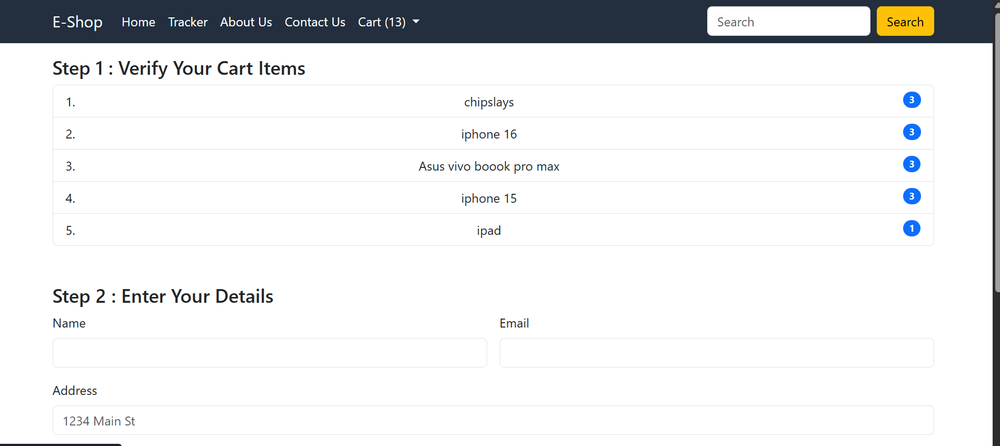

# 🛒 Django E-Commerce Web App

An elegant and fully functional online store built with Django and Bootstrap. Browse products, add to cart, and check out seamlessly—all in one responsive platform.

  

---

## 📸 Screenshots

### 🏠 Home Page


### 🛒 Cart Dropdown


### ✅ Checkout Page


> **Note:** Place your screenshot files in a `screenshots/` folder at the root of the repository and name them `home.png`, `cart-dropdown.png`, and `checkout.png` accordingly.

---

## 🔥 Features

- 🔍 **Product Catalog:** Browse products with images, descriptions, and prices
- ➕ **Add to Cart:** Add items, adjust quantity with +/– buttons, and remove items
- 🛍️ **Persistent Cart:** Cart data stored in `localStorage`, persists across page reloads
- 🧮 **Live Cart Preview:** Navbar dropdown shows current cart items and totals
- 🧼 **Clear Cart:** One-click clear functionality
- ✅ **Checkout Integration:** Simple checkout page to collect user details
- 📱 **Responsive Design:** Fully responsive with Bootstrap

---

## 🛠️ Tech Stack

- **Backend:** Django (Python)
- **Frontend:** HTML, CSS (Bootstrap), JavaScript (jQuery)
- **Storage:** Browser `localStorage` for cart
- **Template Engine:** Django Templates

---

## 🚀 Getting Started

### Prerequisites

- Python 3.7+
- pip
- virtualenv (optional but recommended)

### Installation

1. **Clone the repository**
   ```bash
   git clone https://github.com/Shivampanwar11/<your-repo-name>.git
   cd <your-repo-name>
   ```

2. **Create and activate a virtual environment**
   ```bash
   python -m venv env
   source env/bin/activate   # Windows: env\Scripts\activate
   ```

3. **Install dependencies**
   ```bash
   pip install -r requirements.txt
   ```

4. **Run database migrations**
   ```bash
   python manage.py migrate
   ```

5. **Start the development server**
   ```bash
   python manage.py runserver
   ```

6. **Open your browser** at `http://127.0.0.1:8000/`

---

## 📁 Project Structure

```
├── shop/                 # Django app for e-commerce logic
│   ├── migrations/
│   ├── static/           # CSS, JS, images
│   ├── templates/shop/
│   ├── models.py
│   ├── views.py
│   ├── urls.py
├── myproject/            # Django project settings
│   ├── settings.py
│   ├── urls.py
├── screenshots/          # Project screenshots
│   ├── home.png
│   ├── cart-dropdown.png
│   ├── checkout.png
├── manage.py
├── requirements.txt
└── README.md
```

---

## 👤 Author

**Shivam Panwar**  
[GitHub](https://github.com/Shivampanwar11) • [LinkedIn](https://www.linkedin.com/in/shivam-panwar-0021922b8/)

---

## 📌 License

This project is licensed under the [MIT License](LICENSE).

---

## 🤝 Contributing

Pull requests are welcome! For major changes, please open an issue first to discuss what you'd like to change.

Enjoy building with Django! 🎉

